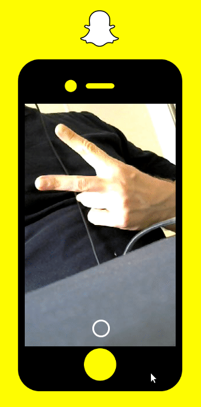

# Snapchat Clone

  

Snapchat Clone is a limited implementation of [Snapchat mobile app](https://play.google.com/store/apps/details?id=com.snapchat.android&hl=pt_BR&gl=US). Keep in mind that this clone project isn't an mobile app, but a website that, visually speaking, we make look like an mobile app in the browser. 

The features implemented in this clone are:

  * Social login with Google account, and logout actions;
  * The flow of (1) send a picture with your webcam, (2) preview the picture, (3) load the feed and (4) click in the pictures to visualize it.

Tools used in the development:

  * React (project created with [create-react-app](https://create-react-app.dev/docs/getting-started/));
    * [react-webcam package](https://www.npmjs.com/package/react-webcam) 
  * Redux;
  * Firebase.

This project has study purposes only.

## How to run this app?

In the project folder:

  * Run `npm install`;
  * Configure you [Firebase](https://firebase.google.com/?hl=pt-br) project, including authentication, stoarge and DB;
  * Create your `.env` based on `.env.example`, and fill it with your Firebase project settings;
  * Run `npm start`.

## How to deploy this app?

The following instructions are a suggestion of how to configure you deploy if you just wanna do that for testing and have an URL to share.

To deploy your app you need to have [Firebase CLI](https://www.npmjs.com/package/firebase-tools) installed.

  * Run `npm run build`;
  * Login in your Firebase account with `firebase login`;
  * Run `firebase init`. You should select your project through the options, type to use `build` as your *public directory*, and select to configure as an SPA;
  * Run `npm deploy`.
